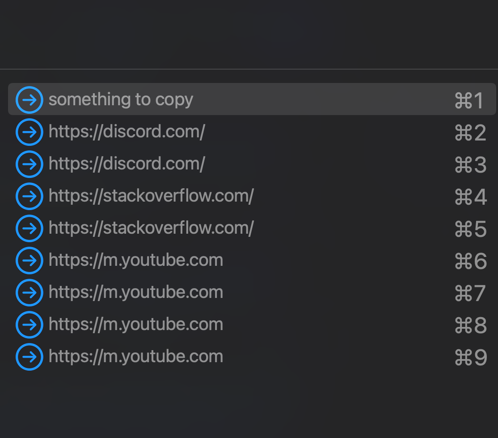
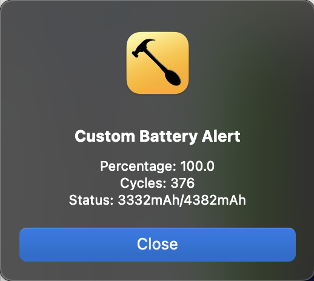

# Documentation

- [**Clipboard History**](#clipboard-historylua)
- [**Battery Status**](#battery-statslua)
- [**Home Assistant Toggle**](#home-assistant-togglelua)

## clipboard-history.lua

- Use `ctrl + c` instead of `cmd + c` to copy

- Use `ctrl + e` to see clipboard history menu

- Use `ctrl + 1-9` to select from the menu

## battery-stats.lua

- Use `ctrl + b` to see battery statistics

## home-assistant-toggle.lua

Update `HASS_URL`, `HASS_TOKEN` & device entity id

- Use `ctrl + cmd + 1` to toggle Home Assistant device
